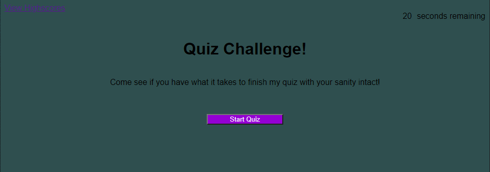

# coding-quiz
## Description
- This website is made to test your knowledge of The Legend of Zelda: Breath of the Wild! The steps are as follow:
    - Press "Start Quiz" to begin the quiz.
    - A timer will start counting down 20 seconds. if the time runs out, you will not be able to answer any following questions and be taken to your end score
    - each correct answer will be followed by a "correct" prompt or "incorrect" prompt and the next question
    - each correct answer will reward the user with 25%
    - After answering all available questions, you will be given the end score screen
    - When at the end score screen, you will be prompted to input your initials
    - after hitting enter, your initials and score will be put on the list of attempts and scores
    - you will be given the option to return to the start page and play again, or wipe all saved scores from the list

## Live Site: 
https://specsnstats.github.io/coding-quiz/

## Repository: 
https://github.com/specsnstats/coding-quiz

## Credits: 
Jonathan Newman with the help of my teacher, teachers assistants, and study group. 